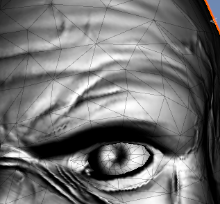

# ShaderStudy
# 쉐이더

### Rendering Pipeline

기본적으로 컴퓨터가 3차원의 물체를 그리기 위해서는 3개의 축(x, y , z)에 대한 좌표을 바탕으로 
3차원의 세계를 정의한 뒤, 해당 좌표를 기준으로 물체의 크기와 모양 등을 그려낼 수 있다. 

이때, 3차원 세계에서 물체의 위치를 나타내는 것을 전역좌표(World Space Position) 이라고 한다.
이 좌표를 기준으로 물체를 구성하는 각 꼭짓점들을 극점(Vertex)이라고 하며 이 극점들의 위치를 나타내기 위해 필요한 것이 지역좌표(Local Spcae Position) 이다. 각 극점들은 이 좌표를 기준으로 얼마나 멀리 떨어져있는지 나타낼 수 있으며 이를 통해 물체의 꼭짓점들을 나타낼 수 있다. 이 극점들을 알맞은 순서에 맞게 연결하여 물체의 형태를 그려낼 수 있다.


이 단계를 **Input Assembler**라고 하며 정점들의 위치와 연결되는 인덱스 값들을 버퍼에 전달하여 선형으로 그려낼 수 있다. 이때, 정점들이 연결되는 모양새는 반드시 삼각형으로 생성되며 삼각형으로 만들어야지 **노말벡터(Normal Vector)** 즉, 해당 면의 수직 벡터를 구할 수 있기 때문이다. 

그래픽카드의 GPU들은 기본적으로 이 삼각형을 빠르게 그려낼 수 있다고한다.

이제 3차원의 물체를 우리가 바라보고 있는 방향으로 그려내기 위한 처리를 해야한다.
이걸 처리하기 위해 행렬변환이라는 선형대수를 사용하여 각 위치에 대한 정보를 변환해야한다. 이 과정을 공간 변환이라고 한다. Model -> View -> Projection 순으로 변환처리가 되며 마지막 Projection 변환과정에서 화면에 나타낼 부분을 정의할 **절두체** 라고 하며 이 절두체는 Near Cliping Plane, Far Cliping Plane, Field of View 들에 의해 정의되며 이 절두체 영역 내에 있지 않은 물체들은 모두 그릴 필요없기에 **Clipng** 된다. 


이후 **Resterization**이라는 과정을 거치며 이 과정에서 앞선 과정에서 그려진 도형을 화면에 표시하기 위해서 각 정점데이터를 픽셀데이터로 변환하는 과정이다. 


이 과정에서 **뷰포트 변환(ViewPort Transformation)** , **스캔변환(Scan Transformation)** 등의 과정을 거치며 이렇게 변환된 정보를 가지고 **Pixel Shader(Fragment Shader)** 에서 화면에 나타낼 색을 표현해낸다. 

이 Pixel Shader과정에서 흔히 말하는 쉐이더의 기능들이 적용되며 여기서 각 픽셀들을 색을 계산하여 물체가 가진 색에 대한 표현을 나타낼 수 있다. 이 과정에서 물체에 적용되는 텍스쳐, 투명도, 그림자, 다양한 빛 처리를 처리할 수 있다. 이때, 멀리 있는 물체와 가까이 있는 물체의 순서가 있어야 물체 간의 원근감이나 뒤의 물체가 앞의 물체를 가리는 이상한 현상을 없앨 수 있다.

--------------------------

### Shader

컴퓨터 그래픽스의 발전이 먼저 사용되는 곳은 영화

- 미리 렌더링 해서 완성된 출력물을 상영, 그렇기 때문에 그래픽 기술의 한계가 없음
​

게임은 실시간 렌더링을 해야하기 때문에 기술 적용이 좀 더 시간이 걸림

고정 파이프라인을 커스텀하기 시작, 제일 처음 적용된 작품은 **토이스토리 1**-

그래픽 연산을 빠르게 하기 위해 그래픽 카드사에서는 고정 파이프라인을 칩으로 집어 넣게 되었음 하지만 고정된 틀에 의해서 나오는 결과물이 너무 고착화 되니깐 개발자들의 불만이 많았음. 그래서 고정 파이프라인의 일부분을 개방해주고자 함.​

즉, 고정 파이프라인의 일부분을 커스터마이징 할 수 있게 해주는 것이 쉐이더, Direct X 8.0부터 쉐이더라는 것이 언급되기 시작하였다.

DirectX 9.0 이전

- Vertex Shader

- Pixel Shader
​

DirectX 10.0 이후

- Geometry Shader 
​

DirectX 11.0 이후

- Computer Shader (OpenCl, CUDA)

- Hull Shader

- Tessellator

- Domain Shader

​


|DirectX|OpenGl|
|:--:|:--:|
|Vertex Shader    |  Vetex Programming|
|Pixel Shader | Fragment Programming |
|HLSL(High Level Sahding Language) | GLSL(OpenGL Shading Language)|
|Geometry Shader|Geometry Shader|
|Hull Shader|Tessellation Control Shader|
|Domain Shader     |Tessellation Evaluation Shader|


셰이더 코드는 우리가 기존에 사용하는 코드 작성 방법과는 다르다. 어셈블리어 라는 것을 활용해서 코드를 짜야 하는데 그것이 힘드니 사람들이 조금 더 편안하게 할 수 있도록 **HLSL**과 같은 셰이더를 C언어 느낌으로 쓸 수 있게 만들어 주는 것이 있다.

또한 픽셀 셰이더 와 정점 셰이더의 경우 코드 작성 방식이 다른데 이러한 점들이 초보자들에게는 사용하기 어려운 점이 있었다.​

유니티에서는 Nvidia에서 쓰는 CG라는 방식, HLSL, GLSL 등과 같은 코드 작동 방식을 섞어서 한 군데서 사용하는 Surface Shader라는 것을 자체적으로 만들었다. 나름의 장단점을 가지고는 있지만 이를 더 진화시켜서 랜더링 파이프 라인을 통째로 건들이는 셰이더 그래프라는 것을 만들면서 대격변을 일으켰다.

이로인해 나온 것이 URP, HDRP 등으로 애니메이션을 만드는 노드 방식으로 셰이더를 다룰 수 있게 되었다.​ 서피스 셰이더에서는 픽셀, 정점 셰이더를 같이 다룰 수 있다.​


### Shader_code

```CSharp
Shader "01_Color" // 쉐이더 파일명
{
	Properties
	{
		_colorR ("Color R", Range(0, 1)) = 1
		_colorG ("Color G", Range(0, 1)) = 1
		_colorB ("Color B", Range(0, 1)) = 1

		_Metallic ("Metallic", Range(0, 1)) = 1
		_Glossiness ("Glossiness", Range(0, 1)) = 1
	}

    
    // 위의 코드들은 이 쉐이더 코드에서 나타낼 속성 값들을 나타낸다.
    // 유니티 Serialize같이 외부에서 속성들 값에 접근해서 조절할 필요가 있는 값들을 선언하여 사용자가 조절할 수 있게 한디. 

```
이 때 '_colorR' 과 같은 외부에서 값을 받거나 외부와 연결된 것은 전부 _를 붙여야 한다. 그런데 _color의 경우 변수명이 아니다. 외부와 내부 사이의 중간 쯤에 있는 것이라고 생각하면 된다.

**("문자열")** 의 경우  인스펙터에서 보여줄 문자열을 말하며, **Range(0, 1)** 의 경우 우리가 아는 범위를 지정하는 Range는 맞지만 이 Range의 자리는 원래 자료형이 들어가는 자리이다.

즉 , 이를 정리하면 color라는 것을 만들 건데 외부에서는 "문자열" 이라는 이름으로 보일 것이고 이 범위 사이를 움직일 수 있게 할 것이다 라는 의미로 해석할 수 있을 것이다.


```CSharp
	SubShader
	{
		CGPROGRAM 

        //CGPROGRAM의 경우 Nvidia(CG 코드) 코드 작동법으로 돌아가는 범위를 시작하겠다는 의미를 나타낸다.
        //SubShader의 의미는 한번에 하나의 셰이더가 돌아가지 않기 때문인데 셰이더에서는 패스라고 해서 여러개가 돌아갈 수 있다. 그렇기 때문에 SubShader라는 것이 들어가는 것이다.

		#pragma surface surf Standard


        //# 이 들어가면 전처리기, 라는 의미이다. 컴파일 할 때 옵션을 정하는 것이다.
        //Standard는 제일 기본적인 셰이더를 기본옵션으로 쓰겠다는 뜻이다. 다만, 여기서 Standard를 쓰게 되면 유니티가 생각한 기본 옵션이 풀옵션이기 때문에 물리기반의 렌더링하는 풀옵션으로 파이프라인을 돌리게 된다.

		struct Input
		{
			float4 color : COLOR;
		};
        // 기본적으로 파이프라인을 통해 지나가는 데이터들을 가져와서 재가공 후 넘겨주는 방식으로 쉐이더가 동작한다. 이 코드에서는 그 데이터의 일부를 가져와서 속성을 가공한다. 이를 Sementic 이라고 한다.
        // surf메서드는 CallBack 메서드 처럼 형식이 정해져있는 메서드이다. 사용하기 위해서는 Input 구조체의 내용이 필요하며, 사용할 내용이 없더라도 선언은 해야 surf를 사용할 수 있다. 

		fixed _colorR;
		fixed _colorG;
		fixed _colorB;

		half _Metallic;
		half _Glossiness;

        // 실제 변수 선언을 한 곳이다.
        // shader 코드에서는 기본적으로 실수 값만 사용하며, 
        /*
        float   4byte 
        fixed   11bit -> 일반적은 자료형은 맨처음 비트가 부호비트이고 색이나 UV를 지정할때는 음수로 지정하면 안되기에 부호를 뺀 11bit만을 사용한다.
        half    2byte -> NVdia의 그래픽카드의 경우, half 체재로 설계되어 half 자료형에 대한 계산이 빠르다.
        */
		//struct SurfaceOutputStandard
		//{
		//	fixed3 Albedo;		//	반사되는 색
		//	fixed3 Normal;		//	법선
		//	half3 Emission;		//	발산되는 색
		//	half Metallic; 		//	0 = 메탈 영향 없음, 1 = 메탈
		//	half Smoothness		//	0= 거칠게, 1 = 부드럽게
		//	half Occlusion;		//	차폐로 인한 환경광의 영향도 (기본 1)
		//	fixed Alpha;		//	투명도
		//};
        // SurfaceOutputStandard 구조체에 들어가있는 내용이다.
    
		void surf(Input In, inout SurfaceOutputStandard 0)
		{
			o.Albedo = float3(_colorR, _colorG, _colorB);
            //Albedo는 빛처리를 받은 최종적으로 마무리된 픽셀값을 나타낸다.
            //Emission는 빛 처리를 받기 이전의 원색을 나타낸다.
			o.Metallic = _Metallic;
			o.Smoothness = _Glossiness;
		}
		ENDCG
	}
}

```
----------------------------

```
void surf (Input IN, inout SurfaceOutputStandard o)
{
	float4 texColor = tex2D (_MainTex, IN.uv_MainTex);
	float4 texToColor = tex2D (_MainTexTo, IN.uv_MainTex);
	o.Emission = lerp(texColor.rgb, texToColor.rgb, _ratio);
}
```
위 코드는 쉐이더에 텍스쳐를 오브젝트의 UV에 맞춰 입혀주고, 해당 UV에 맞는 픽셀 색상값을 보간 처리하여 0 ~ 1까지로 지정하여 얼마나 섞을지 나타낸다. 0에 가까울 수록 texColor에 가까운 색으로, 1에 가까울 수록 texToColor의 색으로 나타낸다.

또한 경우에 따라 같은 물체에 다른 색을 적용해야하는 경우가 있을 것이다. 이때, 절대 사용하지 않을 색 (ex.마젠타 색)으로 나타내고 이를 코드 상에서 팀 컬러를 넘겨주어 색을 넘겨주는 방식으로 색상 구분을 나타낼 수 있다.


 

-------------------

```
o.Emission = IN.uv_MainTex.x;
// 색상 값을 UV.x 값으로 나타낸다.
```


### UV


위 코드를 적용하면 다음과 같이 적용된다.


UV는 적용시킬려는 텍스쳐의 색상을 어떤 위치에 입힐지 지정할 수 있게 하는 개념이다.

위와 같이 그래픽 라이브러리에 대한 UV 위치가 다르며 Unity의 경우 OpenGL 처럼 왼쪽 아래에서 시작한다.

시작 위치부터 끝까지 0 부터 1까지 실수형으로 나타나며 텍스쳐도 같은 방식으로 해당위치의 색상 값을 가져와서 화면에 픽셀 값으로 나타낸다.


코드에서 살짝 수정으로 UV 위치를 조정할 수 있으며, 이를 통해 텍스쳐 애니메이션이 가능하다.


```CSharp


Shader "03_FireEffect"
{
	Properties
	{
		_MainTex ("Albedo (RGB)", 2D) = "white" {}
		_MainTex2 ("Albedo (RGB)", 2D) = "white" {}
	}

	SubShader
	{
		Tags { "RanderType" = "Transparent" "Queue" = "Transparent" }

		CGPROGRAM
		#pragma surface surf Standard alpha:fade

		smapler2D _MainTex;
		smapler2D _MainTex2;

		struct Input
		{
			float2 uv_MainTex;
		}

		void surf (Input IN, inout SurfaceOutputStandard o)
		{
			 fixed4 c2 = tex2D (_MainTex2, float2(IN.uv_MainTex2.x, IN.uv_MainTex2.y - _Time.y));
            fixed4 c = tex2D (_MainTex, IN.uv_MainTex + c2.r);
			o.Emission = c.rgb * c2.rgb;
			o.Alpha = c.a * c2.a;
		}
		ENDCG
	}
	FallBack "Diffuse"
}

```
<p>

</p>


결과는 위와 같이 나타난다.
위와 같이 나타나는 이유는 다음 텍스쳐들의 사용으로 설명할 수 있다.


위와 같은 텍스쳐들을 사용한다.

1번 텍스쳐는 기본 이미지이고 
2번 텍스쳐는 흑백 이미지이다. 둘 다 지정된 uv에 텍스쳐를 입히지만 2번의 경우 시간에 따라 y축 방향으로 uv 값들이 이동하게 되어있다. 그리고 1번 텍스쳐의 uv를 지정해줄 때 2번 텍스쳐의 색상값들을 넣어줌으로서 위와 같은 현상이 나타난다.
텍스쳐를 입힐 때 uv의 위치값을 기준으로 해당 위치의 색상을 가져오는 식으로 표면에 색을 입히는 방식으로 처리된다. 이때, 흑백 이미지의 색상값은 검은색과 흰색의 사이의 값을 가지고 있으며 흰색에 가까울 수록 1에 가깝기에 왜곡이 커지게 된다.
흑백 이미지의 색상값을 uv에 더해주게 되면 그만큼 원래 들어가야할 uv 위치에서 이동하게되며 최종적으로 위와 같은 일렁임 효과가가 나타난다.

------------------------------
### Masking


마스킹은 일종의 거름망 같은 역할이다. Terrain을 제작할 때도 사용하는 것으로 입혀진 텍스쳐에 다른 텍스쳐를 씌우고 어떤 텍스쳐를 그릴지 Layer를 사용한 계층적 표현이나 쉐이더같이 해당 텍스쳐의 색을 통한 보간처리 같은 방법을 통해 위와 같은 방식으로 그릴 수 있다.

``` C

Shader "KCH/04_Masking"
{
    Properties
    {
        _MainTex ("Albedo (RGB)", 2D) = "white" {}
        _MainTex2 ("Albedo (RGB)", 2D) = "white" {}
        _MainTex3 ("Albedo (RGB)", 2D) = "white" {}
        _MainTex4 ("Albedo (RGB)", 2D) = "white" {}
        _MainTex5 ("Albedo (RGB)", 2D) = "white" {}
    }
    SubShader
    {
        Tags { "RenderType"="Opaque" }

        CGPROGRAM
        #pragma surface surf Standard

        sampler2D _MainTex;
        sampler2D _MainTex2;
        sampler2D _MainTex3;
        sampler2D _MainTex4;
        sampler2D _MainTex5;

        struct Input
        {
            float2 uv_MainTex;
        };

        void surf (Input IN, inout SurfaceOutputStandard o)
        {
            // fixed4 c = tex2D (_MainTex, IN.uv_MainTex);
            // fixed4 c2 = tex2D (_MainTex2, IN.uv_MainTex);
            // o.Emission = c.rgb * c2.rgb;

		fixed4 maskC = tex2D (_MainTex, IN.uv_MainTex);
		fixed4 baseC = tex2D (_MainTex2, IN.uv_MainTex);
		fixed4 c3 = tex2D (_MainTex3, IN.uv_MainTex);
		fixed4 c4 = tex2D (_MainTex4, IN.uv_MainTex);
		fixed4 c5 = tex2D (_MainTex5, IN.uv_MainTex);

		o.Albedo = lerp(baseC.rgb, c3.rgb, maskC.r);
		o.Albedo = lerp(o.Albedo, c4.rgb, maskC.g);
		o.Albedo = lerp(o.Albedo, c5.rgb, maskC.b);
		// 이분에서 색을 지정할때 해당 픽셀의 색을 통해 보간 처리를 하며 
		// 마스크의 색에 제일 가까울 수록 베이스 텍스쳐의 색깔에서 나타낼 텍스쳐의 색깔을 가져오는 것으로 만들어졌다.
		// o.Albedo = c3.rgb * maskC.r +
		// 		   c4.rgb * maskC.g +
		// 		   c5.rgb * maskC.b +
		//            baseC * (1 - (maskC.r + maskC.g + maskC.b));
        }
        ENDCG
    }
    FallBack "Diffuse"
}


```
--------------------------
### NormalMap


텍스쳐를 입힐 때, 해당 픽셀의 위치의 노말을 나타내는 텍스쳐로 해당 텍스쳐를 사용하여 해당 픽셀에 대한 빛 처리를 나타낼 수 있다. 빛 반사를 나타내기 위해서는 빛 반사를 구현하기 위한 해당 면이 가진 노말 벡터가 필요하다. 이 노말 벡터를 이용해 빛 반사를 계산하여 해당 부분에 받은 빛에 대한 색깔처리를 나타낼 수 있다. 이 색깔처리로 하나의 텍스쳐를 처리하면서 빛처리를 함으로서 텍스쳐가 입혀진 오브젝트에 대한 음영 표현이 좀 더 세부적으로 나타날 수 있다.

노말 맵 텍스쳐는 대게 XYZ 축을 색깔로 나타낸 것이다. XYZ축은 역시 각자 고유의 실수 값을 가진 데이터이기에 이를 변환하면 색깔로 나타낼 수 있다. 


오브젝트의 축을 기준으로 노말 계산을 하게 되면 왼쪽 사진처럼 녹색, 빨강색, 파란색이 뒤섞인 이미지가 나온다. 물체가 가진 축은 항상 일정하기에 해당 면에 대한 노말을 모델에 맞추게 되면 위와 같이 나온다. 이걸 **로컬공간 노말맵** 이라고 한다.

하지만 만약 물체가 회전하거나 물체가 받고 있는 빛이 움직이는 경우, 빛 계산이 잘못되어 음영이 잘못 나타날 수 있다. 그래서 움직이거나 빛의 영향을 자주 받는 경우, 오른쪽 같은 노말맵을 사용하여 움직임에 영향을 받지 않고 지속적으로 빛 계산이 가능하도록 만든게 **탄젠트 공간 노말맵** 이다. 이는 해당 노말 벡터를 기준으로 계산을 하여 텍스쳐를 나타낸 것으로 축이 노말벡터를 기준으로 만들어지고 이 축은 z축을 기준으로 만들어지기에 이 경우에는 텍스쳐가 대부분 파랗게 나오는 거다. 물체가 움직임고 빛이 움직임에 따라 빛을 계속 계산하기 위해 사용하는 것이기에 비용이 꽤나 많이 발생한다. 그래서 상황에 따라 적절한 노말맵을 사용하여 쉐이더에 연산되는 것 줄이는 것이 중요하다.


### Lambert


난반사에 대한 빛의 분포 조절이다. 위 사진과 같이 빛이 받은 면과 뒤로 갈 수록 점점 어두워지는 것을 볼 수 있다.

```C
float4 LightingTest (SurfaceOutput s, float3 lightDir, float atten) 
{
	float ndotl = saturate(dot(s.Normal, lightDir)); // -1 ~ 1 까지의 수치를 정규화시켜주는 함수
	float4 final;
	final.rgb = ndotl * s.Albedo * _LightColor0.rgb * atten; //atten = 감쇠값
	final.a = s.Alpha;
	return final;
}

```


### Fresnel


카메라가 바라보고 있는 방향을 제외한 색깔 계산 방식으로 위와 같이 모델의 외곽선을 그릴 때 사용할 수 있다. 하지만 실제로 툰 세이딩이나 다른 기법들에 비해 너무 진하게 나타나거나 깔끔한 처리가 안되기에 다른 알고리즘을 적용하는 경우도 있다.
``` C
void surf (Input IN, inout SurfaceOutput o)
{
	fixed4 c = tex2D (_MainTex, IN.uv_MainTex);
	o.Albedo = c.rgb;
	o.Normal = UnpackNormal(tex2D(_BumpMap, IN.uv_BumpMap));
	float rim = saturate(dot(o.Normal, IN.viewDir));

	if(rim > 0.3) rim = 1;
	else rim = -1;

	o.Emission = pow(1 - rim,_RimPower) * _RimColor.rgb * -1; 
	o.Alpha = c.a ;
}
```


### Hologram


``` C

 void surf (Input IN, inout SurfaceOutput o)
{
	fixed4 c = tex2D (_MainTex, IN.uv_MainTex);
	//o.Albedo = c.rgb;
	//o.Emission = float3(0, 1, 0);
	o.Emission = IN.worldPos.xyz;
	o.Emission = pow(frac(IN.worldPos.z*3- _Time.y),30)* float3(1,0,1);
	float rim = saturate(dot(o.Normal, IN.viewDir));
	rim = pow(1 - rim, 3);
	//o.Alpha = rim * abs(sin(_Time.y));
	o.Alpha = 1;
}
```

### Phong



퐁세이딩이란 기본적으로 노말 벡터를 이용해 빛 반사를 해서 색을 나타내면 해당 면의 전체 색을 그리게 된다. 하지만 phong 쉐이딩으로 면과 면이 가진 노말 벡터들의 보간 처리를 하여 부드러운 색 처리를 하는 쉐이딩이다.

``` C

float4 LightingTest 
(SurfaceOutput s, float3 lightDir, float3 viewDir, float atten) 
{
	// Specular
	float3 H = normalize(lightDir + viewDir);
	float spec = saturate(dot(H, s.Normal));
	spec = pow(spec, 10);
	return spec;
}

```

## 2Pass


2Pass는 기본적으로 물체를 두번 그리는 방식으로 물체를 표현하는 방식이다.
단순히 쉐이더가 두번 그리기는 작업을 진행하는 것이기에 비용은 생각보다 크지 않지만 모델에 대한 처리가 조금만 잘


